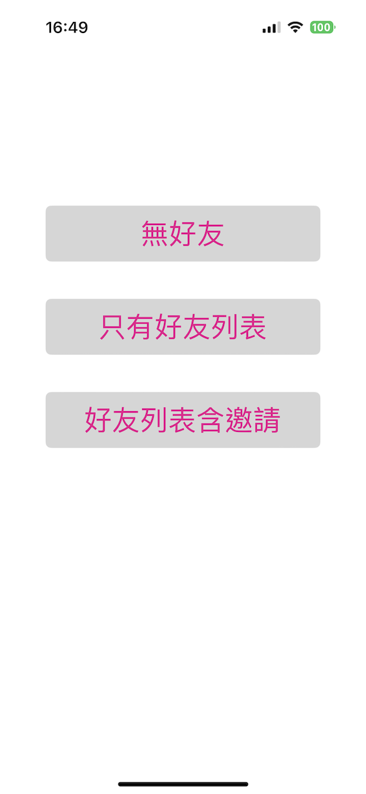
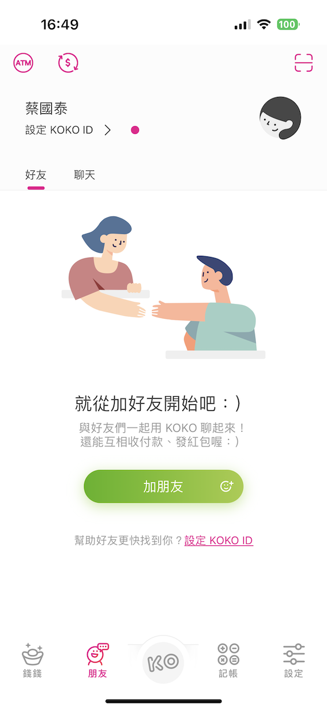
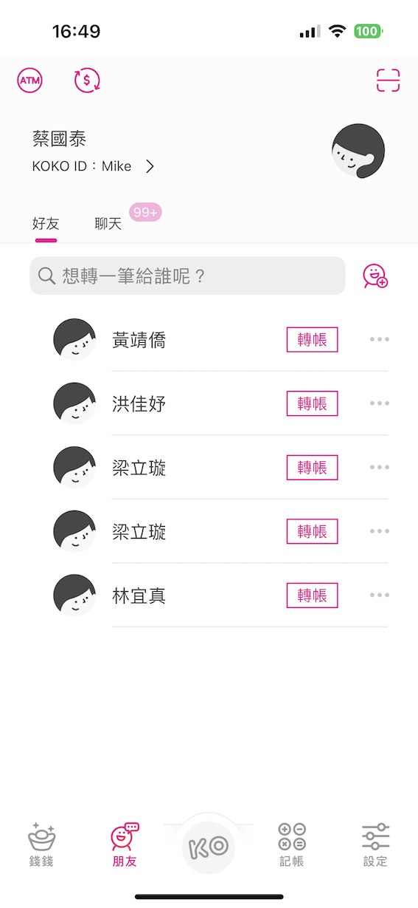
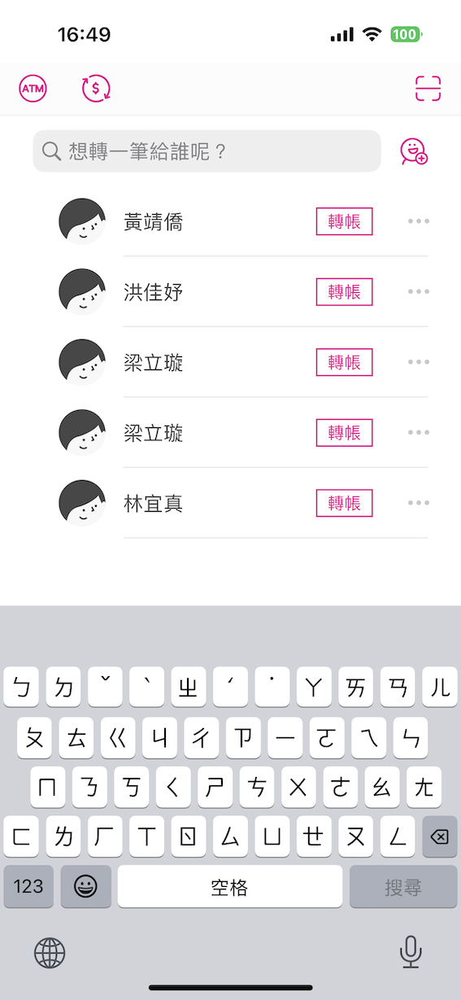
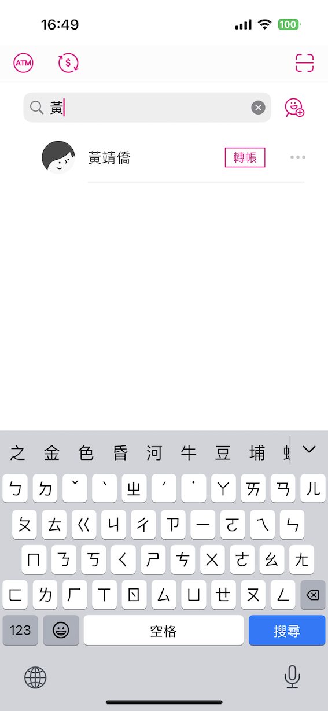
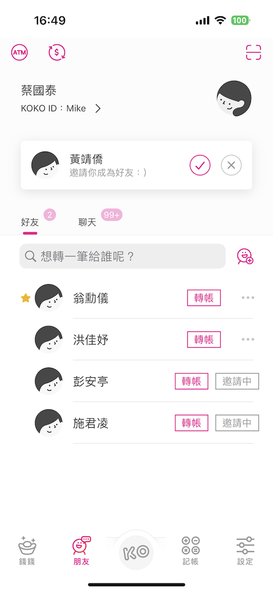
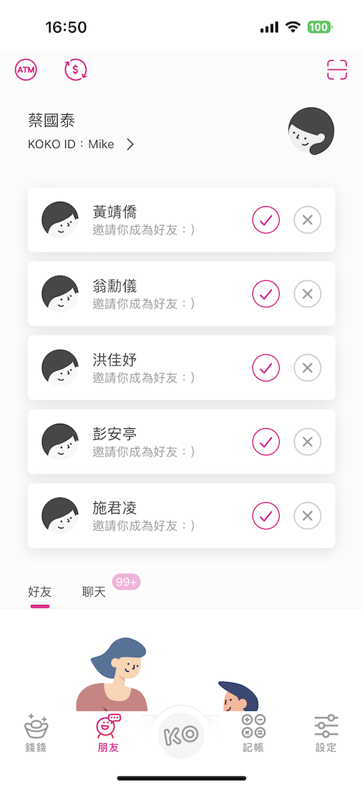
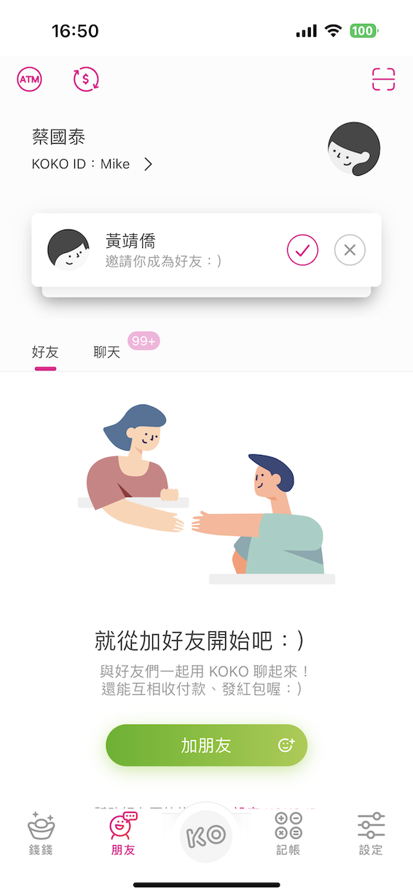

# CUB_interview
國泰世華面試考題

## 概要
* DB 使用 CoreData
* 架構使用 MVC-N

## 完成畫面圖例
1. 選擇情境的頁面  

2. 無好友的畫面，可點選左上角 'ATM' 圖示回到選擇情境頁面  

3. 只有好友的畫面列表  

4. 只有好友的畫面列表，搜尋上推的畫面  

5. 只有好友的畫面列表，搜尋時的過濾功能  

6. 好友與邀請的畫面  

7. 好友與邀請的畫面，刻意修改儲存 status = 0 產生的畫面，用來展示列表展開與縮合(透過點擊邀請的項目 cell 來展開與縮合)  

